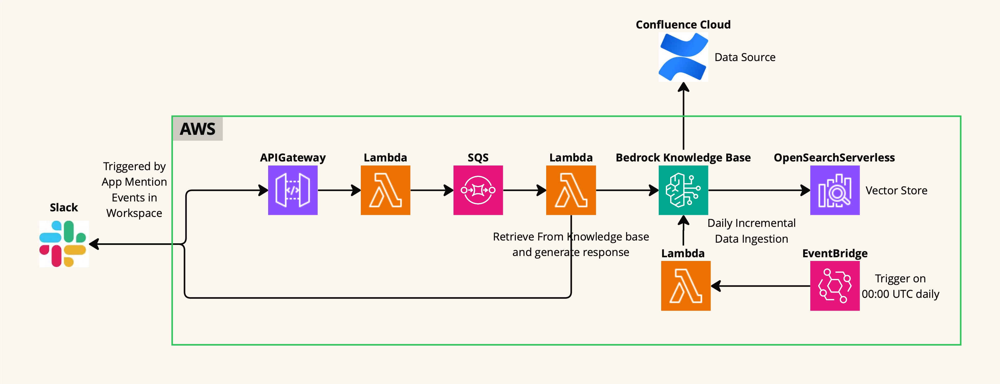
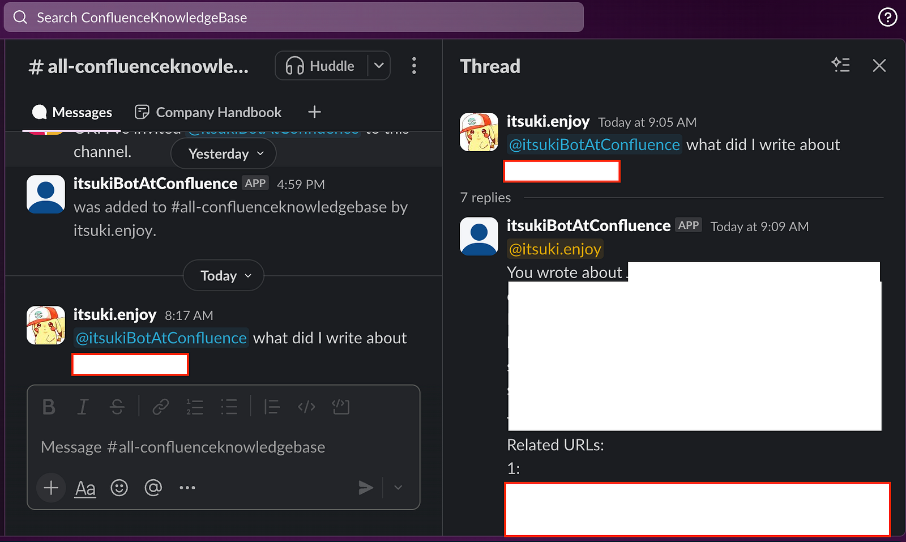

# Slack Bot + Confluence As Knowledge Base

Blog: [Hey Slack! Answer my questions on my Confluence!](https://medium.com/@itsuki.enjoy/hey-slack-answer-my-questions-on-my-confluence-7edfbb0fa55d)

## Overview
A Slack Bot powered by AWS Bedrock Knowledge with the Datasource being Confluence Cloud to answer questions regarding to confluence contents.

Mention the bot along with the questions you have about the your Confluence content, it will then respond with the result together with some related links to the confluence resources.

Also, since we will have a lambda to perform some incremental data synchronization for us everyday, automatically, the contents to generate the results based on will be (hopefully) pretty up to date!


## Cloud Architecture

<br>
- Vector Database: OpenSearch Serverless
- App (Bot) Mention Event Handling: API Gateway + Lambda + SQS + Lambda
- Daily Incremental Data Ingestion: Lambda with EventBridge Trigger


## Demo



## Set Up

### Knowledge Base
1. Create a knowledge base with Confluence as datasource like what I have shared with you previously in [Confluence + Bedrock KnowledgeBase + OpenSearch Serverless: Console & CDK](https://medium.com/@itsuki.enjoy/confluence-bedrock-knowledgebase-opensearch-serverless-console-cdk-93ec05abe8ce). 
2. Memo down the Knowledge Base Id.

### Slack Configuration (1)
1. Create a Slack App from the [Apps Console](https://api.slack.com/apps) for the workspace that you would like to use this bot for.
2. Navigate to **Basic Information** and obtain **Signing Secret**
3. Navigate to **OAuth & Permissions** to Obtain the **Bot OAuth Token**, and Add `chat:write` and `chat:write.public` to Bot Token Scopes

### CDK Stack
1. In `cdk.json`, set up the following environment variables.
```
"develop": {
  "AWS_REGION": "us-east-1",
  "SLACK_SIGNING_SECRET": "...",
  "BOT_OAUTH_TOKEN": "....",
  "CHAT_MODEL_ID": "us.anthropic.claude-sonnet-4-20250514-v1:0",
  "KNOWLEDGE_BASE_ID": "..."
}
```
<br>

2. Deploy the stack by running `cdk deploy`. This will deploy the queue, the API Gateway and its proxy Lambda, the event bridge as well as its handler lambda, with necessary permission configured.
3. Obtain the API Gateway Endpoint URL. This should be something like `https://xxx.execute-api.us-east-1.amazonaws.com/prod/`.


### Slack Configuration (2)
1. Navigate to **Event Subscriptions** in the app settings page.
2. **Enable Events** by toggle the switch to On.
3. For **Request URL**, enter the API GAteway endpoint URL. You should see the **Verified** checkmark if success.
4. For **Subscribe to events on behalf of users**, add `app_mentions:read`. This will add the necessary OAuth scope automatically.
5. Navigate to **Installed App Settings** page and install the app to the workspace.

For more details on setting up Slack Events API, please check out my blog [here](https://medium.com/@itsuki.enjoy/trigger-lambda-from-slack-messages-with-slack-events-api-d73d80d8ae97).


### Confirm
Above is all we need to get the Bot running.
<br>
Head to the Slack Workspace that we have installed the bot on, select any channel, and send a message mentioning the bot!
If this is your first time @ the bot in a specific channel, you will be prompted to add it as member! The message will be delivered after that!
